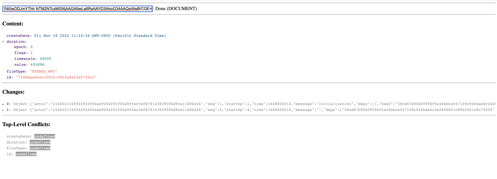

# Automerge Viewer

This is a very basic Angular application that allows for visualization of [Automerge](automerge.org) types. To use it, simply enter a base64-encoded Automerge type into the input field.

## Example

Input:
```
hW9Kg7wCTk8A7gIBIMFrUhFllEk0n+q5D6/88Aqf/sPvh4FDgpWW2c4R0L02AaY3pzdjxkohWYZyJ5bfdjJ/m9h9lFWsJH3Du/Rv/58BCAECAwITAyMHNRFAA0MCVgIMAQQCBhVbIQIjDTQBQgZWEldB gAEFgQECgwECAgACAX4DCn6OvN+bBgB+DkluaXRpYWxpemF0aW9uAH4AAX8AAgcABQgAAAUEBAQJfwpjcmVhdGVEYXRlAghkdXJhdGlvbnYIZmlsZVR5cGUCaWQFZXBvY2gFZmxhZ3MJdGltZXNjYWxl BXZhbHVlBWVwb2NoBWZsYWdzCXRpbWVzY2FsZQV2YWx1ZQ0AegEDBXkBAgMBfwIDAQ1/AQIACgF/aQIAfKYBlgQUEwI0fhQTAjSd0+3hyDBTVEVSRU9fV0FWNzEwYmJhYTBlNDFjNTA1Ni0wODJmYThh NTM2NTczMGNjAAGA9wLa6RsAAYD3AtrpG34AAQsAfwB/CQE=
```



## Building

To run this tool locally:
1. `npm install`
2. `ng serve`

## Current Functionality

For `Document` inputs, the current content will be displayed along with the entire set of changes and any conflicts on top-level keys.

For `SyncState` inputs, the decoded sync state will be displayed.

For `SyncMessage` inputs, the decoded sync message will be displayed.

## Contributions and Future Functionality

This is something that was put together very quickly by a non-web developer to aid in our usage of Automerge, so is rough around the edges, and there are no immediate plans for enhancements.

However, among other things, we would like to expand the document visualization. The list of changes is not very human-readable. Ideally, the tool could show document changes as a graph and allow viewing a diff for individual changes similar to what you would expect for graphical tools for git.

Any contributions or suggestions are welcome.

## License

This tool is released under the MIT license. See LICENSE.txt for more information.
